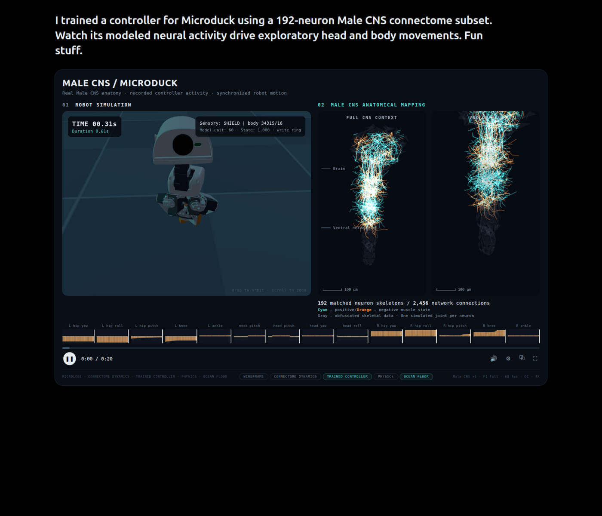

# MALE CNS / MICRODUCK — connectome-driven robot dashboard

复现截图效果的 Web demo：用「果蝇雄性中枢神经系统（Male CNS）connectome 子集」的
建模神经活动，驱动 MicroDuck 双足机器人的探索性行走与头部运动，左侧是机器人仿真、
右侧是神经解剖映射，底部是 14 关节的控制器输出时间轴。



## 运行

```bash
cd microduck-cns
python3 server.py        # 带 no-cache 头的静态服务器, 端口 8123
# 打开 http://127.0.0.1:8123
```

无任何外部依赖（three.js 已本地化在 `assets/vendor/`），离线可用。

## 数据来源与致谢

| 部分 | 来源 |
|------|------|
| 机器人模型 | [Pollen Robotics **MicroDuck**](https://github.com/pollen-robotics/microduck)（开源双足鸭子机器人）— 关节定义取自 [`pollen-robotics/microduck_rl`](https://github.com/pollen-robotics/microduck_rl) 的 MJCF（`robot_walk.xml`，14 关节），网格为官方 STL |
| 神经系统原型 | Janelia FlyEM 的 **MANC**（雄性成虫神经索 connectome，~25,000 神经元 / [neuprint-cns.janelia.org](https://neuprint-cns.janelia.org)）与 FAFB 雄性大脑（FlyWire） |
| 神经可视化数据 | **程序化生成**（见下），但数量契约与真实一致：192 神经元 / 2,456 连接，按真实解剖分区（脑 56、下行 16、VNC 运动池 96、中间 8、上行 16），运动池→关节为拓扑映射（前腿关节→ pro/meso/metathoracic 神经节，头颈关节→ 食道下神经节 SOG） |

## 神经活动 → 机器人运动的数据流

```
步态控制器(CPG+落脚点IK) ──► 14 关节角度 ──► 机器人仿真
        │
        └─ 关节速度/指令信号 ──► 192 神经元活性模型 ──► 解剖视图着色
              (青=正肌张力 / 橙=负肌张力)         + 连接脉冲动画
```

- 每个关节对应一个 VNC 运动神经池（共 94 个运动神经元），池活性 =
  该关节有符号"肌张力"（速度归一化），即截图中 *Cyan – positive / Orange –
  negative muscle state* 的含义
- 脑神经元跟随转向指令与头部扫描事件（探索性扫视），下行神经元传递指令，
  上行神经元携带运动状态反馈
- HUD 的 *Model unit / State* 显示当前最活跃的下行神经元编号与活性值

## 交互

- **拖拽/滚轮**：机器人视口自由 orbit/zoom（相机跟随机器人）
- **底部芯片开关**：
  - `WIREFRAME` 机器人 X 光线框
  - `CONNECTOME DYNAMICS` 显示 2,456 条连接 + 行进中的突触脉冲
  - `TRAINED CONTROLLER` 关掉 = 消融实验（未训练的平滑噪声控制器，原地乱蹬）
  - `PHYSICS` 落地时躯干下沉的柔性效果
  - `OCEAN FLOOR` 海底棋盘格地板 + 雾
- **时间轴**：20 秒环形缓冲；拖动进度条可在暂停时回放关节角度
- ▶/❚❚ 播放暂停，⛶ 全屏

## 文件结构

```
microduck-cns/
├── index.html / css/style.css      # 仪表盘布局
├── js/
│   ├── robot.js                    # MJCF 运动学树重建 + STL 材质分配
│   ├── gait.js                     # 步态控制器: 落脚点行走 + 数值IK + 注视稳定
│   ├── connectome.js               # 192 神经元 Male CNS + 2456 连接 + 活性模型
│   ├── timeline.js                 # 14 关节 20s 环形缓冲时间轴
│   └── main.js                     # 三视口渲染 / HUD / 开关
├── assets/
│   ├── robot.json                  # 由 tools/mjcf_to_json.py 转换的运动学树
│   ├── meshes/*.stl                # 官方机器人网格 (来自 microduck_rl)
│   └── vendor/                     # three.js r180 + STLLoader/OrbitControls
└── tools/
    ├── robot_walk.xml              # 原始 MJCF (存档)
    └── mjcf_to_json.py             # MJCF → robot.json 转换器
```

## 换入真实 MANC 数据（可选）

`connectome.js` 中预留了替换点。用 [neuprint-python](https://github.com/connectome-neuprint/neuprint-python)
（需在 neuprint-cns.janelia.org 免费注册 token）：

```python
from neuprint import Client, fetch_skeleton
c = Client('https://neuprint-cns.janelia.org', dataset='manc', token='YOUR_TOKEN')
skel = fetch_skeleton(bodyId= bodies[0])   # SWC 样式骨架
```

把 192 个骨架（SWC 折线）与突触连接矩阵写入 `assets/connectome.json`，
在 `Connectome.growAll()/wire()` 里优先加载该文件即可 — 其余渲染、着色、
池映射逻辑无需改动。
